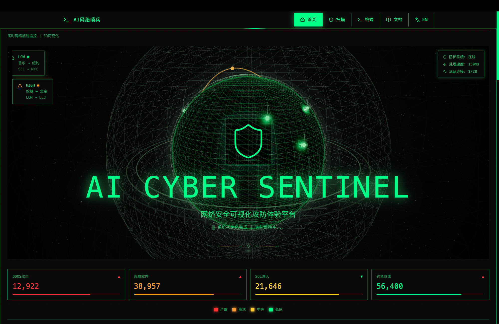

# AI Cyber Sentinel

网络安全威胁可视化态势感知平台 - 智能代码安全扫描系统



## 功能特性

- **代码安全扫描** - 支持单文件和项目文件夹扫描
- **AST 安全分析** - 基于抽象语法树的静态代码分析
- **AI 智能分析** - 结合大语言模型提供智能安全建议
- **实时日志** - 实时展示分析进度和结果
- **3D 可视化** - Three.js 驱动的网络安全态势展示
- **国际化支持** - 中英文界面切换

## 技术栈

- **前端框架**: React 18 + TypeScript
- **样式方案**: Tailwind CSS
- **3D 渲染**: Three.js + React Three Fiber
- **构建工具**: Vite
- **UI 组件**: Radix UI + shadcn/ui
- **图表可视化**: Recharts
- **部署平台**: Vercel

## 快速开始

### 环境要求

- Node.js 18+
- npm 9+

### 安装依赖

```bash
npm install
```

### 开发模式

```bash
npm run dev
```

访问 http://localhost:5173 查看应用

### 构建生产版本

```bash
npm run build
```

构建产物将输出到 `build` 目录

## 部署

项目已配置 Vercel 部署支持，详情请参考 [DEPLOY.md](./DEPLOY.md)

### 环境变量

| 变量名 | 说明 | 默认值 |
|--------|------|--------|
| `SCAN_MODE` | 扫描模式 (`traditional` 或 `ai`) | `traditional` |
| `DEEPSEEK_API_KEY` | DeepSeek API Key（AI 模式必需） | - |

## 项目结构

```
AI_Cyber_Sentinel/
├── api/                 # API 接口定义
├── backend/             # 后端服务
├── src/
│   ├── components/      # React 组件
│   │   ├── ui/          # UI 基础组件
│   │   └── pages/       # 页面组件
│   ├── contexts/         # React Context
│   ├── App.tsx          # 应用入口
│   └── main.tsx         # 渲染入口
├── build/               # 构建输出目录
├── test_project/        # 测试项目
├── vercel.json          # Vercel 配置
└── vite.config.ts       # Vite 配置
```

## License

Private - All Rights Reserved
